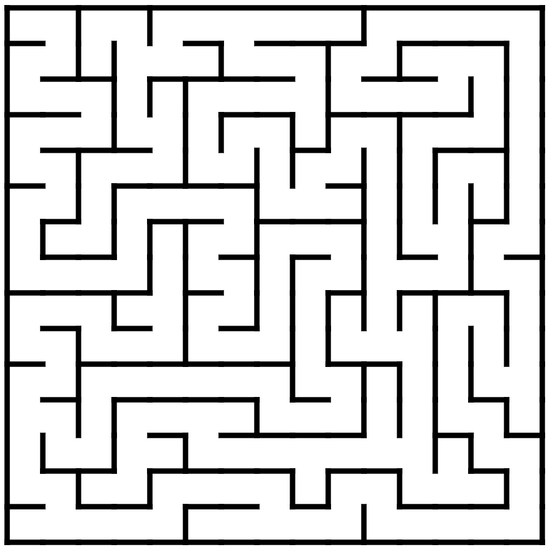

# pathfinder

## Setup

The aim of this code is to compare various path-finding algorithms. The purpose of each of the files is as follows:

1. **maze.py** - It has the class Maze which constructs the maze in which the search algorithms will work
2. **createMaze.py** - It provides a visual representation of how the maze is constructed using depth-first search

## Result

The maze.py code creates an svg image of the maze. A screenshot of a 10x10 maze is shown below

  

With the createMaze.py we can view how the algorithm constructs the maze. The video shows how the above maze is built.

https://github.com/Bhuyashi/pathfinder/assets/28145026/4fc3dae7-fd64-4ddb-8ca5-f9761b191d89

